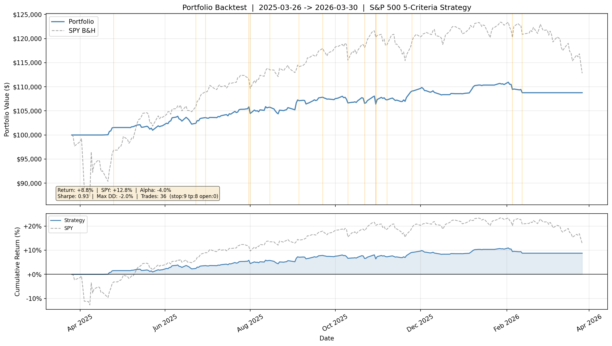
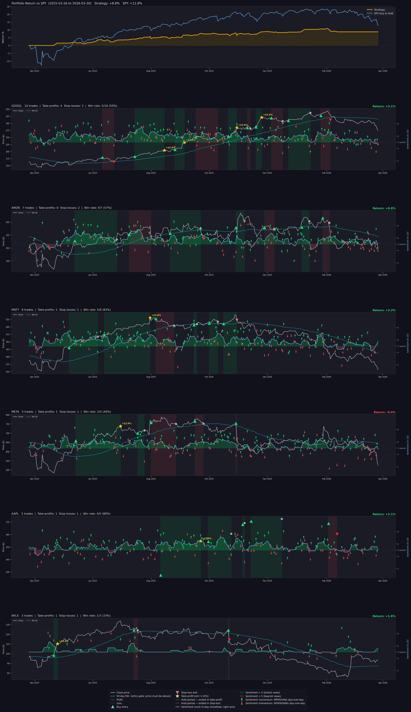

# LLM-Driven Trading Bot
### Student Capital Growth Strategy — Inflation-Beating Returns with Disciplined Risk

---

## Strategic Objective

This bot is designed for **student investors** who need their savings to grow faster than inflation without exposing limited capital to unnecessary drawdowns. It is not a speculative trading system.

**Plain-English thesis:** The bot only trades when five independent layers of evidence agree — long-term stock quality, liquidity, risk/volatility profile, current market trend, and credible positive LLM-scored news sentiment. If any layer is weak or contradictory, the bot does nothing and holds cash.

---

## Architecture: 5-Criteria Funnel Pipeline

```
S&P 500 (~500 stocks)  [or --tickers override]
   |
[C1] Quality Screen                         src/data.py
     10yr annualised return >= 8.5%
     Sharpe ratio > 0
   ~200-250 quality stocks

   |
[C4] Liquidity Screen                       src/data.py
     Avg daily volume > 1M shares
     Price > $5 (no penny stocks)

   |
[C5] Risk / Volatility Screen               src/data.py
     Annual volatility < 40%
     Max drawdown > -30% (last 2 years)
     Ranked by combined risk + trend score
   ~50-100 survivors

   |
[C3] LLM Sentiment Gate (daily, per trade)  src/sentiment.py + src/sentiment_cache.py
     Gate 0: price > MA50 (local uptrend confirmed)
     Gate 1: tech_signal_norm >= 0.3 (price meaningfully above MA50)
     Gate 2: LLM sentiment score >= 6.0 / 10
     Gate 3: Consensus >= 70% of articles agree
     Gate 4: Day-over-day sentiment not worsening
     Gate 5: >= 5 deduplicated headlines available
     Gate 6: RSI(14) in [35, 55] -- buying pullbacks, not peaks

   |
[RANK] Portfolio Execution                  src/backtest_portfolio.py
     Top-ranked survivors entered by risk-adjusted score
     Max 10 concurrent positions
     Risk-based sizing: 2% portfolio risk per trade, 15% position cap
```

---

## Project Structure

| File | Role |
|------|------|
| `main.py` | Unified entry point -- live trading or backtest via CLI flags |
| `src/bot.py` | Live paper-trading entry point -- full pipeline scan + Alpaca order routing |
| `src/data.py` | Market data (Alpaca + yfinance fallback); C1/C4/C5 screening; 5-criteria pipeline |
| `src/sentiment.py` | LLM sentiment agent -- DistilRoBERTa-financial with industry-aware conviction scoring, Jaccard dedup, time-decay weighting |
| `src/sentiment_cache.py` | Historical sentiment pre-builder -- caches daily LLM scores per ticker to CSV so backtests load instantly |
| `src/backtest_portfolio.py` | **Primary backtester** -- full portfolio simulation with daily C3 gates, ATR trailing stop, risk-based sizing, RSI filter |
| `src/optimize.py` | Parameter sweep -- multiprocessing grid search, saves to CSV |
| `src/verify.py` | Walk-forward validator -- validates parameter combos on a held-out date window |
| `src/plot_analysis.py` | Per-ticker equity chart -- price, MA50, buy/sell markers, sentiment overlay, momentum arrows |
| `test_components.py` | Connectivity check -- verifies API keys and LLM model load |

---

## Setup Instructions

### 1. Python Environment

Requires Python 3.8+. First run downloads the HuggingFace model (~250 MB).

**Windows:**
```bash
python -m venv venv
venv\Scripts\activate
pip install -r requirements.txt
```

**macOS/Linux:**
```bash
python3 -m venv venv
source venv/bin/activate
pip install -r requirements.txt
```

### 2. API Keys

Sign up at [alpaca.markets](https://alpaca.markets) (free paper trading account). Then set environment variables:

**Windows (PowerShell):**
```powershell
$env:APCA_API_KEY_ID     = "YOUR_API_KEY_HERE"
$env:APCA_API_SECRET_KEY = "YOUR_API_SECRET_HERE"
$env:APCA_API_BASE_URL   = "https://paper-api.alpaca.markets"
```

**macOS / Linux:**
```bash
export APCA_API_KEY_ID="YOUR_API_KEY_HERE"
export APCA_API_SECRET_KEY="YOUR_API_SECRET_HERE"
export APCA_API_BASE_URL="https://paper-api.alpaca.markets"
```

### 3. Verify Setup

```bash
python test_components.py
```

This confirms the Alpaca API connection works and the HuggingFace model loads correctly.

---

## Running the Project

### Live paper trading — continuous loop

```bash
python main.py
```

The bot runs **continuously** until stopped with `Ctrl+C`:

```
Startup
  └─ Build ranked list once (C1 + C4/C5 screens across S&P 500)
       └─ while True:
             ├─ Market closed?  → sleep 5 min, check again
             ├─ New day?        → refresh ranked list
             ├─ monitor_positions()
             │     ├─ Price < MA50?          → sell (TREND FAIL)
             │     └─ Sentiment score < 4.0? → sell (SENTIMENT SELL)
             ├─ scan_for_entries()  (only if slots < 10 open positions)
             │     └─ evaluate candidates in rank order, buy if C3 passes
             └─ sleep 15 min → repeat
```

**Bracket orders** (stop-loss at −2%, take-profit at +5%) are submitted directly to Alpaca and managed on their servers 24/7. The bot's monitoring loop handles the two exits that require live judgement — sentiment deterioration and trend failure.

**When you stop the bot** (`Ctrl+C`), all open positions and bracket orders remain active in your Alpaca paper account. The bot prints a reminder confirming this.

**CLI options:**

| Flag | Default | Description |
|------|---------|-------------|
| `--interval N` | 15 | Minutes between monitoring scans |
| `--once` | off | Run a single scan then exit (no loop) |
| `--demo` | off | **Bypass market-hours check** — runs scans even when the market is closed (for live demos and presentations) |
| `--max-positions N` | 10 | Maximum total open positions at any time — if 2 are already open, the bot will open at most 8 more |
| `--max-vol` | 0.35 | C5 volatility ceiling |
| `--max-dd` | -0.30 | C5 drawdown floor |

```bash
# Faster scans for demo — check every 5 minutes
python main.py --interval 5

# Single scan then exit
python main.py --once

# ── Demo / presentation mode ──────────────────────────────────────────
# Run outside NYSE market hours (evenings, weekends, classroom demos)
python main.py --demo

# Demo with faster scan cadence
python main.py --demo --interval 2

# Demo single scan then exit
python main.py --demo --once
```

> **Demo mode note:** When `--demo` is active, the bot skips the market-closed sleep and executes the full sentiment scan immediately. The header will show `[DEMO — market hours bypassed]` and each scan cycle will print `[DEMO] Market closed — bypassing for demo.` so it is clear to your audience that live trading is simulated outside market hours. Open positions and bracket orders in your Alpaca paper account are unaffected.

### Portfolio backtest (historical simulation)

```bash
# Full backtest from a start date
python main.py --backtest --start 2025-03-26

# With a high-news-volume ticker override (faster, better sentiment coverage)
python main.py --backtest --start 2025-03-26 \
    --tickers AAPL,MSFT,GOOGL,META,AMZN,NFLX,CRM

# Skip sentiment cache rebuild (use existing cached scores)
python main.py --backtest --start 2025-03-26 \
    --tickers AAPL,MSFT,GOOGL,META,AMZN,NFLX,CRM \
    --skip-cache-build
```

### Generate per-ticker trade analysis chart

```bash
python src/plot_analysis.py --backtest-start 2025-03-26
```

Outputs `plots/trade_analysis.png` — per-ticker panels with price, MA50, buy/sell markers, and colour-coded returns.

---

## LLM Integration — Sentiment Pipeline

### Model Choice

We use `mrm8488/distilroberta-finetuned-financial-news-sentiment-analysis`, a DistilRoBERTa model fine-tuned on financial news corpora.

**Why this model over GPT/general LLMs:**
- Domain-specific fine-tuning on financial news outperforms zero-shot general models on sentiment classification
- Runs locally (no API cost or rate limits) and is fully reproducible
- Deterministic — same inputs always produce the same score, enabling reliable backtesting
- Lightweight (~250 MB) — suitable for local hardware without GPU

### Conviction Score Mapping (0–10 scale)

The model outputs `POSITIVE`, `NEGATIVE`, or `NEUTRAL` with a confidence value `c` (0–1). We map these to a conviction score:

| Model Output | Formula | Range |
|---|---|---|
| `POSITIVE` with confidence `c` | `5 + (c × 5)` | 5.0 – 10.0 |
| `NEGATIVE` with confidence `c` | `5 - (c × 5)` | 0.0 – 5.0 |
| `NEUTRAL` | `5.0` | exactly 5.0 |

A score of 5.0 means neutral (no information). The entry gate requires a score of **>= 6.0** — this corresponds to a `POSITIVE` classification with at least 20% confidence, which filters out weak or borderline signals.

### Article Quality Pipeline (three pre-processing steps)

**Step 1 — Jaccard Near-Duplicate Removal**

When Reuters, Bloomberg, Yahoo, and CNBC all publish the same press release, counting them as four independent articles inflates consensus. We remove near-duplicates using 3-gram character Jaccard similarity (threshold 0.72) before any scoring. First occurrence is kept; later near-matches are dropped.

**Step 2 — Time-Decay Weighting**

Articles are weighted by `exp(-0.08 × age_in_hours)`. A story from 2 hours ago gets full weight; a story from 20 hours ago gets ~20% weight. This makes daily scores responsive to breaking news rather than stale coverage.

**Step 3 — Industry-Aware Relevance Amplification**

Not all news moves all stocks equally. "TSMC fab capacity" matters far more for NVDA than MSFT. Each headline is amplified or dampened by a sector-specific weight:

```
direction           = base_conviction - 5        # signed from neutral
adjusted_conviction = clamp(5 + direction × weight, 0, 10)
```

Sector weights are defined in `src/industry_weights.py`. High-weight sectors (e.g. semiconductors) amplify relevant signals; low-weight sectors dampen noise.

### 7-Gate C3 Condition (all gates must pass for entry)

| Gate | Condition | Purpose |
|------|-----------|---------|
| 0 | `price > MA50` | Hard block when price is below its 50-day trend |
| 1 | `tech_signal_norm >= 0.3` | Price must be meaningfully above MA50, not just touching |
| 2 | `LLM score >= 6.0` | Genuine positive conviction required |
| 3 | `consensus >= 70%` | Majority of articles must agree on direction |
| 4 | `today_score >= yesterday_score - 0.5` | Sentiment must not be materially worsening |
| 5 | `deduped_headlines >= 5` | Prevents single-article signals from entering |
| 6 | `RSI(14) in [35, 55]` | Entry only on pullbacks, not at overbought peaks |

### Guardrails Against Noisy Signals

| Guardrail | Value | Purpose |
|-----------|-------|---------|
| Jaccard deduplication | threshold 0.72 | Removes syndicated copies of the same story |
| Time-decay | λ = 0.08/hr | Discounts stale coverage |
| Headline minimum | >= 5 (after dedup) | Prevents single-article signals |
| Consensus threshold | >= 70% agreement | Majority must point the same direction |
| Conviction floor | >= 6.0 / 10 | LLM must be genuinely positive |
| Sentiment momentum | not worsening | Day-over-day direction check |
| RSI gate | 35 – 55 | Only enter on pullbacks, not at local peaks |
| MA50 gate | `price > MA50` | Hard block during confirmed downtrends |

---

## Risk Controls Per Trade

| Control | Value | Rationale |
|---------|-------|-----------|
| Trailing stop | ATR(14) × 3.5 below peak price | Adapts stop width to each stock's typical daily range |
| Take-profit | 12% above entry | Hard ceiling; exits before reversal; fires consistently across trade durations |
| Trend failure exit | Close < MA50 (after 5-day hold) | Cuts positions when uptrend breaks |
| Sentiment sell | Score < 4.0, consensus >= 70% | Exits early if LLM turns decisively negative |
| Position size | Risk-based: 2% portfolio risk / trade | Scales with portfolio value; adapts to current price |
| Max position | 15% of cash per position | Prevents concentration; ~6 positions max |
| MA50 gate | `price > MA50` required for entry | No new positions while price is below short-term trend |
| RSI entry gate | RSI(14) in [35, 55] | Buys on pullbacks, not overbought peaks |
| Re-entry cooldown | 5 trading days after exit | Prevents churning the same ticker repeatedly |

---

## Key Technical Signals

### tech_score (daily, live-computed)

```
tech_score = (price/MA50 - 1) + (trend_component)
```

Measures how far price has moved above its short-term trend average. Positive values indicate the stock is in an uptrend with momentum. Normalised to 0–1; a floor of 0.3 is required before any entry is considered.

### RSI(14) — Wilder's Smoothing

```
RS  = avg_gain / avg_loss   (14-day EWM, alpha = 1/14)
RSI = 100 - (100 / (1 + RS))
```

Entry only when RSI is 35–55: the stock is in an uptrend but has pulled back enough to offer a reasonable entry price. RSI above 55 signals the stock may already be extended; RSI below 35 signals potential breakdown.

### ATR(14) Trailing Stop

```
ATR = 14-day exponential moving average of True Range
stop = peak_price - ATR × 3.5
```

The True Range of a day is `max(high - low, |high - prev_close|, |low - prev_close|)`. ATR averages this over 14 days. Multiplying by 3.5 gives a stop wide enough to survive normal daily noise without being stopped out prematurely. The stop only ever moves up — it locks in gains as the position appreciates.

---

## Backtest Results

*Window: 2025-03-26 -> 2026-03-30. Capital: $100,000. Universe: AAPL, MSFT, GOOGL, META, AMZN, NFLX, CRM (7 after C5 volatility filter).*

**+8.77% return | Sharpe 0.93 | Max drawdown -2.0% | Win rate 58% (21/36 trades)**

8 take-profit exits, 9 trailing-stop exits, 19 positions open at period end. SPY returned +12.80% over the same period.

---

## Known Limitations

1. **Small universe:** Only 7 of 10 high-news tickers pass the C5 volatility filter (NVDA, AMD, TSLA filtered out as too volatile). With only 7 candidates, the portfolio is rarely fully deployed.

2. **Sentiment cache not rebuilt between runs:** Existing caches use the scoring logic active when they were built. Re-running with `--skip-cache-build` will use stale scores. Remove cache files in `data/` and re-run without the flag after any logic changes to `sentiment.py`.

3. **Alpaca news API archive limit:** The free Alpaca news feed retains approximately 12 months of history. Backtesting dates older than ~12 months will return empty sentiment caches (no news → no trades pass the sentiment gate).

4. **Survivorship bias:** The S&P 500 constituent list is fetched live (current membership). Stocks delisted or removed during the backtest window may be included or excluded inconsistently.

5. **Paper trading only:** All live trades execute in Alpaca's simulated paper environment. Live trading requires additional compliance and risk review.

---

## Why LLMs Are Appropriate Here

LLMs process **unstructured text** (news headlines, earnings language, analyst commentary) and convert it into structured signals. They are explicitly **not** used to predict prices from numbers. The price prediction and execution logic is handled deterministically by the technical indicators and risk controls.

The LLM determines sentiment direction and conviction. Independent technical signals (MA50, RSI, trend score, ATR stop) act as filters and position managers. Neither component alone is sufficient — this separation of concerns is the core design principle.

The conviction score formula is transparent and auditable: a model output of `POSITIVE` with 90% confidence always maps to a score of 9.5/10. There is no black-box weighting or hidden state.

---

## Equity Curve



Backtest window: 2025-03-26 to 2026-03-30. Starting capital: $100,000.

---

## Trade Analysis



Per-ticker panels showing price history, MA50, entry/exit markers, sentiment score overlay, and colour-coded returns for each trade.
